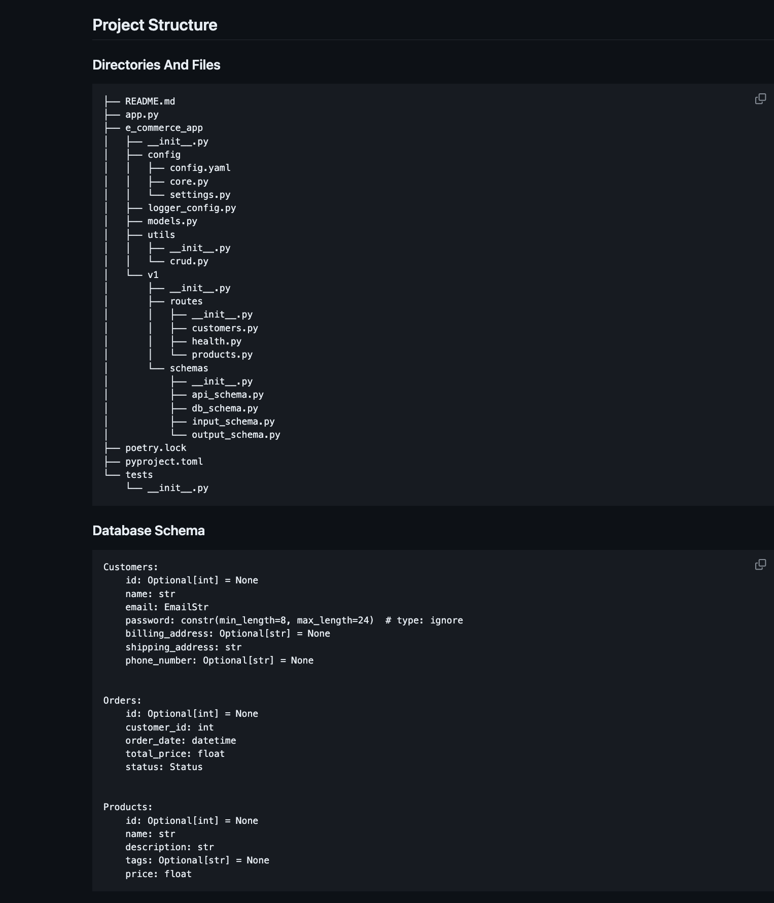

<!-- markdownlint-disable-file MD033 MD045-->
# FastAPI Tutorial

## Table of Content

- [FastAPI Tutorial](#fastapi-tutorial)
  - [Table of Content](#table-of-content)
  - [Official Docs](#official-docs)
    - [Basic Tutorial](#basic-tutorial)
    - [Advanced Tutorial](#advanced-tutorial)
    - [A Simple E-commerce Website Project](#a-simple-e-commerce-website-project)
      - [Project Structure And Data Schema](#project-structure-and-data-schema)

## Official Docs

- To use the official docs, click [here](https://fastapi.tiangolo.com/learn/).

### Basic Tutorial

- Click [here](https://fastapi.tiangolo.com/tutorial/).

### Advanced Tutorial

- Click [here](https://fastapi.tiangolo.com/advanced/).

### A Simple E-commerce Website Project

- Click [here](https://github.com/chineidu/nlp-projects/tree/main/e-commerce-app) to view project.

#### Project Structure And Data Schema

