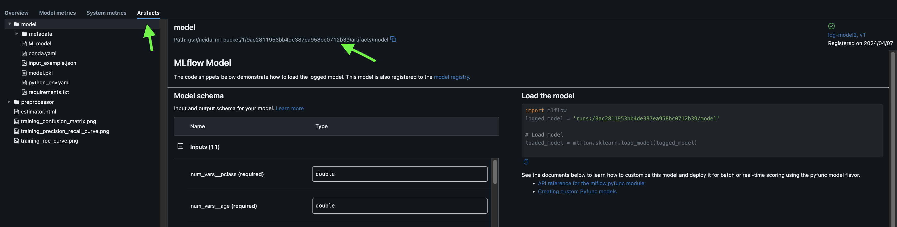

<!-- markdownlint-disable-file MD033 MD045-->
# GCP MLFlow Setup

- **[Source](https://github.com/emkademy/mlflow-tracking-server-gcp-deployment)**

## Table of Contents

- [GCP MLFlow Setup](#gcp-mlflow-setup)
  - [Table of Contents](#table-of-contents)
  - [Steps](#steps)
    - [1. Install GCloud SDK](#1-install-gcloud-sdk)
    - [2. Create Database](#2-create-database)
    - [3. Create a Google Storage Cloud Bucket](#3-create-a-google-storage-cloud-bucket)
    - [4. Set Environment Variables](#4-set-environment-variables)
    - [4b. Setup Scripts](#4b-setup-scripts)
      - [a.) run-server.sh](#a-run-serversh)
      - [b.) create-server.sh](#b-create-serversh)
      - [c.) startup-server.sh](#c-startup-serversh)
    - [4c. IMPORTANT](#4c-important)
      - [Method 1: Using the Google Cloud Console](#method-1-using-the-google-cloud-console)
      - [Method 2: Using the gcloud Command Line Tool](#method-2-using-the-gcloud-command-line-tool)
    - [5. Deployment](#5-deployment)
    - [6. Connect To The Server](#6-connect-to-the-server)
    - [7. Track Experiment](#7-track-experiment)

## Steps

### 1. Install GCloud SDK

- Check [docs](https://cloud.google.com/sdk/docs/install)

### 2. Create Database

- MLFlow uses a database in order to store logged parameters, and metrics (metadata).
- You can create a serverless PostgreSQL database that is running on GCP by following these steps:
  - Goto `CloudSQL` and create a `serverless PostgreSQL` instance on GCP.
  - Create a new user: `Users` -> `ADD USER ACCOUNT`, and save its password to `GCP Secret Manager`,
  - Create a new database: `Databases` -> `CREATE DATABASE`.
  - To enable only `Private` access, goto `Overview` -> `EDIT` `Connections` -> change `Public IP address` to `Private IP address`. (Optional)

### 3. Create a Google Storage Cloud Bucket

- MLFlow needs a storage to store your artifacts.

### 4. Set Environment Variables

- Create a file in order to set some environment variables.

```.env
# ===========================
# ./envs/.mlflow.prod
# ===========================
# ===== MLFlow =====
MLFLOW_HOST=0.0.0.0
MLFLOW_PORT=5251

# ===== Postgres =====
POSTGRES_CONNECTION_NAME=<postgres-connection-name> (you can find in on GCP -> SQL -> your database -> Connection Name)
POSTGRES_USER=<postgres-username>
POSTGRES_PASSWORD_SECRET_NAME=<postgres-secret-manager-name>
POSTGRES_HOST=<postgres-host>
POSTGRES_PORT=5432
POSTGRES_DATABASE_NAME=<postgres-database-name>

ARTIFACT_STORE=gs://<your_gsc_bucket>

# ===== General =====
GCP_PROJECT_ID=<gcp-project-id>
PROJECT_NAME=<gcp-project-name> (it has to be lowercasing)
DOCKER_IMAGE_NAME=${PROJECT_NAME}-mlflow
GCP_DOCKER_REGISTERY_NAME=<gcp-artifact-registery-name>
GCP_DOCKER_REGISTERY_URL=europe-west4-docker.pkg.dev/${GCP_PROJECT_ID}/${GCP_DOCKER_REGISTERY_NAME}/${DOCKER_IMAGE_NAME}

IMAGE_NAME=<gcp-machine-image-name> (recommended: projects/debian-cloud/global/images/debian-12-bookworm-v20240312)
IMAGE_PROJECT_ID=<gcp-machine-image-project-name> (recommended: ubuntu-os-cloud)

# ===== Compute Instance =====
VM_NAME=${PROJECT_NAME}-mlflow
REGION=<region>
ZONE=<zone>
LABELS=<comma-seperated-key-value-pairs>
MACHINE_TYPE=<machine-type>
NETWORK=<network> (recommended: default)
SUBNET=<subnet> (recommended: default)
SERVICE_ACCOUNT=<enter_your_service_account_email>
```

### 4b. Setup Scripts

#### a.) run-server.sh

```sh
# ===========================
# ./docker/run-server.sh
# ===========================
#!/bin/bash

# Enforce stricter error handling in the script.
set -euo pipefail

BACKEND_STORE_URI="postgresql://${POSTGRES_USER}:${POSTGRES_PASSWORD}@${POSTGRES_HOST}:${POSTGRES_PORT}/${POSTGRES_DATABASE_NAME}"

mlflow server \
    -h ${MLFLOW_HOST} \
    -p ${MLFLOW_PORT} \
    --backend-store-uri ${BACKEND_STORE_URI} \
    --default-artifact-root ${ARTIFACT_STORE} \

```

#### b.) create-server.sh

```sh
# ===========================
# ./scripts/rcreate-server.sh
# ===========================
#!/usr/bin/env bash

# Enforce stricter error handling in the script.
set -euo pipefail

# Grant the appropriate IAM role. It allows the instance to access secrets in Secret Manager.
gcloud projects add-iam-policy-binding ${GCP_PROJECT_ID} \
  --member="serviceAccount:${SERVICE_ACCOUNT}" \
  --role="roles/secretmanager.secretAccessor"

# Create the VM instance and add metadata
gcloud compute instances create "${VM_NAME}" \
  --image "${IMAGE_NAME}" \
  --image-project "${IMAGE_PROJECT_ID}" \
  --boot-disk-auto-delete \
  --labels="${LABELS}" \
  --machine-type="${MACHINE_TYPE}" \
  --service-account="${SERVICE_ACCOUNT}" \
  --zone="${ZONE}" \
  --no-address \
  --network="${NETWORK}" \
  --subnet="${SUBNET}" \
  --scopes https://www.googleapis.com/auth/cloud-platform,https://www.googleapis.com/auth/cloud.useraccounts.readonly,https://www.googleapis.com/auth/cloudruntimeconfig \
  --project="${GCP_PROJECT_ID}" \
  --metadata-from-file=startup-script=./scripts/startup-script.sh \
  --metadata \
gcp_docker_registery_url="${GCP_DOCKER_REGISTERY_URL}:${IMAGE_TAG}",\
mlflow_host="${MLFLOW_HOST}",\
mlflow_port="${MLFLOW_PORT}",\
artifact_store="${ARTIFACT_STORE}",\
postgres_user="${POSTGRES_USER}",\
postgres_host="${POSTGRES_HOST}",\
postgres_port="${POSTGRES_PORT}",\
postgres_database_name="${POSTGRES_DATABASE_NAME}",\
postgres_password_secret_name="${POSTGRES_PASSWORD_SECRET_NAME}"
```

#### c.) startup-server.sh

```sh
# ===========================
# ./scripts/startup-server.sh
# ===========================
#!/bin/bash

# Setup environment variables obtained from instance metadata
MLFLOW_HOST=$(curl --silent http://metadata.google.internal/computeMetadata/v1/instance/attributes/mlflow_host -H "Metadata-Flavor: Google")
MLFLOW_PORT=$(curl --silent http://metadata.google.internal/computeMetadata/v1/instance/attributes/mlflow_port -H "Metadata-Flavor: Google")
ARTIFACT_STORE=$(curl --silent http://metadata.google.internal/computeMetadata/v1/instance/attributes/artifact_store -H "Metadata-Flavor: Google")
POSTGRES_USER=$(curl --silent http://metadata.google.internal/computeMetadata/v1/instance/attributes/postgres_user -H "Metadata-Flavor: Google")
POSTGRES_HOST=$(curl --silent http://metadata.google.internal/computeMetadata/v1/instance/attributes/postgres_host -H "Metadata-Flavor: Google")
POSTGRES_PORT=$(curl --silent http://metadata.google.internal/computeMetadata/v1/instance/attributes/postgres_port -H "Metadata-Flavor: Google")
POSTGRES_DATABASE_NAME=$(curl --silent http://metadata.google.internal/computeMetadata/v1/instance/attributes/postgres_database_name -H "Metadata-Flavor: Google")
POSTGRES_PASSWORD_SECRET_NAME=$(curl --silent http://metadata.google.internal/computeMetadata/v1/instance/attributes/postgres_password_secret_name -H "Metadata-Flavor: Google")
GCP_DOCKER_REGISTERY_URL=$(curl --silent http://metadata.google.internal/computeMetadata/v1/instance/attributes/gcp_docker_registery_url -H "Metadata-Flavor: Google")

# Docker Installation (if not already installed)
# Remember to create a service called Cloud NAT to allow outbound internet access.
curl -fsSL https://get.docker.com -o get-docker.sh
sudo sh get-docker.sh

# Download the image on to the VM
echo '=========== Downloading Docker Image ============'
gcloud auth configure-docker --quiet europe-west2-docker.pkg.dev
echo "GCP_DOCKER_REGISTERY_URL = ${GCP_DOCKER_REGISTERY_URL}"
time sudo docker pull "${GCP_DOCKER_REGISTERY_URL}"

# Stop the jupyter instance (if running)
# systemctl stop jupyter

# Run the docker container
sudo docker run --init --network host --ipc host --user root --hostname "$(hostname)" --privileged \
  --log-driver=gcplogs \
  -e POSTGRES_USER="${POSTGRES_USER}" \
  -e POSTGRES_PASSWORD=$(gcloud secrets versions access latest --secret="${POSTGRES_PASSWORD_SECRET_NAME}") \
  -e POSTGRES_HOST="${POSTGRES_HOST}" \
  -e POSTGRES_PORT="${POSTGRES_PORT}" \
  -e POSTGRES_DATABASE_NAME="${POSTGRES_DATABASE_NAME}" \
  -e ARTIFACT_STORE="${ARTIFACT_STORE}" \
  -e MLFLOW_HOST="${MLFLOW_HOST}" \
  -e MLFLOW_PORT="${MLFLOW_PORT}" \
  ${GCP_DOCKER_REGISTERY_URL}
```

### 4c. IMPORTANT

- Fot the code below to work, you need to create a service called Cloud NAT.

```sh
# Docker Installation (if not already installed)
# Remember to create a service called Cloud NAT to allow outbound internet access.
# Check the README for more details on setting up the NAT gateway.
curl -fsSL https://get.docker.com -o get-docker.sh
sudo sh get-docker.sh
```

#### Method 1: Using the Google Cloud Console

- Go to the VPC Network page in the [Google Cloud Console](https://console.cloud.google.com/).
- Select your desired project.
- Click on Cloud NAT in the navigation pane.
- Click "Get started" or "Create NAT gateway" depending on if it's your first Cloud NAT gateway.
- Provide a Gateway name.
- Choose Public or Private for the NAT type. Public NAT allows outbound traffic to the internet, while Private NAT provides a private IP for VMs behind the NAT to access the internet.
- Select the VPC network where you want to create the Cloud NAT.
- Choose the Region for the Cloud NAT gateway.
- Select or create a Cloud Router in the chosen region. Cloud Router helps route traffic between your VPC network and Cloud NAT.
- Optionally, configure Advanced configuration settings like Stackdriver logging for detailed monitoring.
- Click Create to provision the Cloud NAT gateway.

[](https://postimg.cc/kVKPQR3V)

#### Method 2: Using the gcloud Command Line Tool

```sh
gcloud compute nat gateways create \
  --gateway-name=my-nat-gateway \
  --auto-allocate-ip \  # Automatically allocate an IP address
  --nat-type=PUBLIC \
  --region=us-central1 \
  --network=my-vpc-network \
  --router=my-cloud-router

```

- Explanation of Flags:

```text
--gateway-name: Name for your Cloud NAT gateway.
--auto-allocate-ip: Automatically allocate an IP address for the Cloud NAT gateway (recommended).
--nat-type: Choose "PUBLIC" or "PRIVATE".
--region: Region where you want to create the Cloud NAT gateway.
--network: VPC network where you want to deploy the Cloud NAT gateway.
--router: An existing Cloud Router in the chosen region to associate with the Cloud NAT gateway.
```

### 5. Deployment

- The `Makefile.prod` that contains targets to build, push and deploy the docker image can be found [here](https://github.com/chineidu/MLOps_Tutorials/blob/main/other_notes/Automations/DVC/Makefile.prod).
- Once everything is set, you can deploy the MLFlow server by running the following command:

```sh
make deploy IMAGE_TAG=<docker-image-tag>

# e.g.
make -f deploy IMAGE_TAG=v1

# If you have multiple Makefiles, you can point to a particular file
make -f Makefile.prod deploy IMAGE_TAG=v1
```

- As `IMAGE_TAG`, you can specify anything you like.
- A docker image will be built and pushed to GCP Docker Registery, and the image will be tagged with the specified `IMAGE_TAG` for versioning purposes.

### 6. Connect To The Server

- This setup doesn't use external IP, you need `ssh tunneling` in order to view the web API.
- Run to apply `ssh tunneling`:

```sh
gcloud compute ssh "${VM_NAME}" --zone "${ZONE}" --tunnel-through-iap -- -N -L "${MLFLOW_PORT}:localhost:${MLFLOW_PORT}"

# e.g.
gcloud compute ssh my-sserver --zone europe-west2-a --tunnel-through-iap -- -N -L 5251:localhost:5251
```

- Click [http://localhost:5251](http://localhost:5251) to access your MLFlow instance.

### 7. Track Experiment

- I had issues logging the experiment artifacts into GCS. The quick fix was to load my serviice account key file.
- Add the code snippet in your script or Jupyther notebook to authenticate with GCS before tracking experiments.

```py
import os
from google.cloud import storage


# Initialize the client with explicit credentials
os.environ["GOOGLE_APPLICATION_CREDENTIALS"] = (
    "./path_to_your_service_account.json"
)
```


